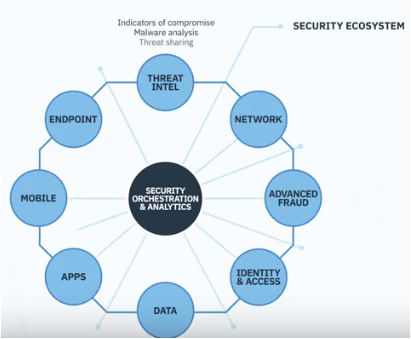
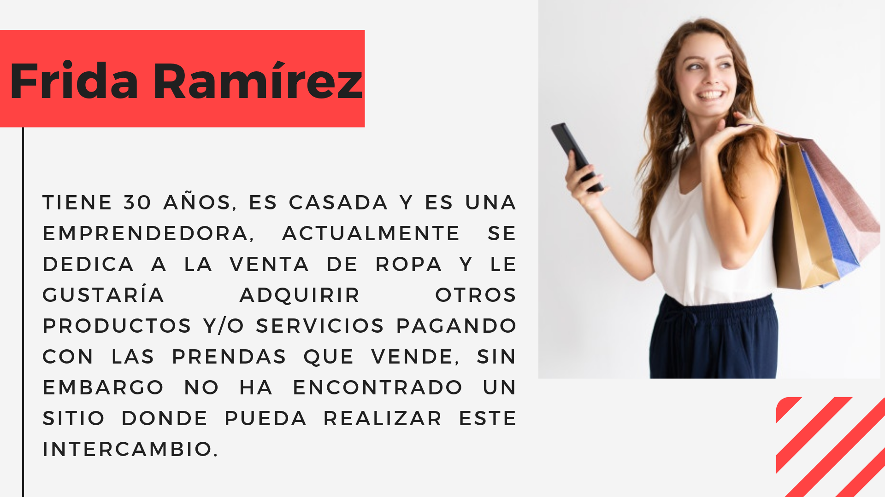

<!--Desarrollar la propuesta de arquitectura, roadmap de seguridad y resumen de la solución-->

.png)

## Índice

* [1. Propuesta de arquitectura](#1-arquitectura)
* [2. Roadmap de seguridad](#2-roadmap-de-seguridad)
* [3. Resumen de la solución](#3-solución)
* [4. UserPersona](#4-UserPersona)

***

## 1. Arquitectura

### Diagrama de flujo

Hemos creado el siguiente [Diagrama de flujo](https://www.lucidchart.com/documents/edit/79aa1cfa-2945-4a01-a3ab-598c0689df14/0?beaconFlowId=FFBF2194926340A5) para explicar claramente como queremos que el usuario utilice el producto con base en las propuestas de valor presentadas como "Historias de usuario", que son:

1. Que los usuarixs puedan hacer un registro y elijan el perfil con el que van a interactuar:

* Cliente
* Repartidor

2. Que los usuarixs, después de registrase, inicien sesión y elijan sus intereses:
- Cliente
* ¿Que ofrecen?
* ¿Que buscan?

- Repartidor
* ¿Dónde se encuentra?
* ¿Que distancia están dispuestos a recorrer?

3. Que el usuario, al tener dudas, pueda encontrar una respuesta al interactuar con un chatbot disponible y entrenable por Watson de IBM.

4. Que el usuario, entienda claramente que tendrá un periodo de "Prueba gratutita" y que deberá pagar una suscripción después del vencimiento del plazo.

y/o

5. Que el usuario pueda emitir una tarjeta virtual con código QR en la que su dinero pueda ser utilizado para realizar los trueques.

## 2. Roadmap de seguridad

Seguiremos la recomendaciones de IBM las cuales pueden ser consultada en el siguiente video: 

"[The IBM Security Immune System](https://www.youtube.com/watch?v=UUil205ZzmU)"

En el primer alcance, unicamente por cuestión de tiempo se usarán los servicios de autenticación de Firebase.

## 3. Resumen de la solución

Instagram, Snapchat, Twitter, Facebook, Twitch, Linkedin, etc. 

Las redes sociales han invadido nuestras vidas. Las amamos u odiamos, y muchos no podemos vivir sin ellas.

Pueden tener muchas funcionalidades integradas. 
La solución a la problematica de Frida, emprendedora de Victoria 147, es crear una plataforma que favorezca el trueque entre particulares con tecnologías disruptivas y que permitan la transparencia de los intercambios con seguridad y velocidad.

## 4. UserPersona

# Entrenamiento inicial del Chatbot

Para entrenar el Chatbot se crearón intenciones que son las posibles consultas que hará el usuario. Tambien se crearon nodos de dialogo que es lo que que el chatbot va a responder al usuario dependiendo la pregunta de este.

Algunas consultas con las que se entrenó al chatbot:

1. Duda Calcular Precio

posibles preguntas de usuario:

-Como saber el precio de mi producto servicio

-Dime donde calculo el precio de mi producto.

Respuesta del chatbot:

Usa el formulario que se encuentra en la sección "Calcula el precio de tu trueque"

2. Duda como conseguir tarjeta virtual.

Posibles preguntas del usuario:

-como adquiero mi tarjeta virtual

-¿Donde puedo conseguir mi tarjeta virtual?

Respuesta del Chatbot:

Ingresa a la sección "Mi tarjeta virtual" en el menú desplegable de la pantalla de inicio de nuestra pagina.

3. Duda producto y/o servicio insatisfecho.

Posibles preguntas del usuario:

-Que pasa si el producto o servicio no era lo que yo esperaba.

-Que pasa si el servicio no es lo que ofrecian en la pagina.

Respuesta del Chatbot:

Ingresa a la sección "Producto y/o servicio insatisfecho" en el menú desplegable de la pantalla de inicio de la pagina.

4. Dudas unirme al equipo de T4T.

Posibles preguntas del usuario:

-Cual es el precio de la suscripción para unirme al equipo de this 4 that.

-Debo forzosamente tener auto para hacer entregas?

Respuesta del Chatbot:

Ve a la sección de ayuda en el menú desplegable y selecciona la parte "dudas equipo T4T". Ahi encontraras todo lo relacionado a el equipo.

5. Duda pagar intercambio con dinero.

Posibles preguntas del usuario:

-¿Es necesario adquirir cosas solo con el trueque o tambien puedo comprarlas?

-Que hago si no tengo un producto para intercambiar pero si dinero?

Respuesta del Chatbot:

Eso depende del usuario con el que deseas hacer el intercambio. Eso lo podrás consultar en su perfil.

Link del Chatbot: 

https://assistant-chat-us-south.watsonplatform.net/web/public/19752491-aadf-4172-8067-1350d5f4ed01
